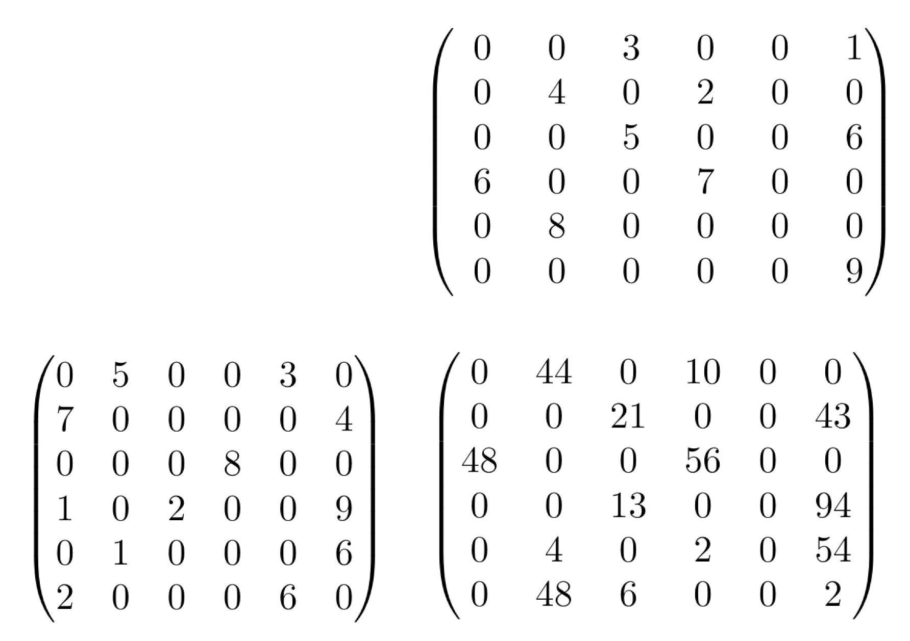

# HPC-zad2-MPI

## Communication-Efficient Sparse Matrix Multiplication
Your goal is to implement parallel algorithm for multiplying two sparse matrices A and B. You may find the article we will refer to here: https://arxiv.org/pdf/2010.08526. There are three steps of this assignment:
- First is just a regular parallel sparse matrix multiplication algorithm;
- Second is build on top of the first one, but is more effective in terms of communication;
- Third improves it even more by introducing load-balancing.

## Steps description (as described in the paper)
- 2D-SUMMA: First step is the 2D-SUMMA based algorithm, described in section III.A. Its a baseline implementation. You will use it as a comparison and as an intermediate phase of the next step. Matrices are distributed in a `p_r × p_c` process grid.
- 3D-SUMMA: 2D-SUMMA is then used as a part of 3D-SUMMA (Section III.B) algorithm. This step introduces better communication efficiency. Matrices are distributed in a `p_r × p_c × l` process grid.

In the first two steps you should split the matrices based on indices only. Note that as we deal with sparse matrices, it may cause substantial imbalance between the processes.
- 3D-SUMMA with load balancing: In this step you should introduce additional procedure and run it before the 3D-SUMMA step (but after the initial distribution). In this procedure processes may freely exchange their input matrices. It's up to you how to split the data. Remember to describe this procedure in the report.

The main goal of this assignment is to compare how sparse matrix multiplication works in three cases: naive implementation, communication efficient implementation and communication efficient with load balancing. Your assignment should consist of those 3 implementations that perform valid multiplication on matrices and a report that describes your approach and compares performance of the three algorithms.

## Specific requirements
Your goal is to implement three versions of sparse multiple matrix multiplication, i.e., compute `C = A ⋅ B`.

Assume that A and B are square matrices and `p_c = p_r`. You may also assume that the number of rows/columns will be large enough so that each process has at least one row/column assigned.

However, you cannot assume that the number of MPI processes divides the number of rows/columns.

Process 0 loads the sparse matrices A and B from [CSR](https://en.wikipedia.org/wiki/Sparse_matrix#Compressed_sparse_row_.28CSR.2C_CRS_or_Yale_format.29) files and then sends it to other processes. In the first two steps each process should receive data from the same amount of rows/columns (or +-1, if the division is not equal). It means in particular that each process may recive very different load. Its for purpose, you may optimize this behavior in the last version of your algorithm.

In version with load balancing keep in mind that matrices loading phase should run just like before, i.e. matrices should be distributed to keep equal rows/columns number. **Balancing should run only after it** and redistribute data between processes. The reason is that we want measurements independent of input distribution method.

Note that the result of multiplication may also be sparse. Dense representation of the result matrix may result in out of memory error. On the other hand, you may assume that each process have enough memory to store its result in CSR representation.  

Please don't use any numerical libraries for local matrix multiplication on a node. You should write this algorithm by yourself.

## Input and output
Programs will be tested automatically. Please stick to the format below.

Your program will be run using the following instructions:
```bash
unzip xx123456.zip; cd xx123456; rm -rf build; mkdir build; cd build; cmake ..; make

srun ./matmul [-a sparse_matrix_file_a] [-b sparse_matrix_file_b] [-v] [-g g_value] [-t 2D|3D|balanced] [-l value]
```
where:
- `-a/b sparse_matrix_file_a/b` is a path to [CSR](https://en.wikipedia.org/wiki/Sparse_matrix#Compressed_sparse_row_.28CSR.2C_CRS_or_Yale_format.29) file storing given sparse matrix. The first row contains 4 integers: the number of rows, the number of columns, the total number of non-zero elements, and the maximum number of non-zero elements in each row. The following 3 rows specify values (array `V` in wikipedia's description); column indices (array `COL_INDEX`); and row offsets (array `ROW_INDEX`). Values may be integers or doubles in format 12.345.
- `-v` prints the matrix C (the multiplication result) in the row-major order: the first line specifies the number of rows and the number of columns of the result; i+1-th line is the i-th row of the matrix; this option will be used only on small matrices. This argument is optional, but may be helpful during testing.
- `-t type` specifies which version of the algorithm you have to use. Possible type values are 2D, 3D and balanced. They refer to the 2D-SUMMA; 3D-SUMMA; 3D-SUMMA with load balancing, respectively. In case of `balanced`, there will be additional argument (`-l`), the value of layers `l` introduced by the 3D-SUMMA.
- `-l layers` specifies the number of layers in the 3D-SUMMA procedure. Applies only to 3D and balanced versions of the algorithm and should be ignored in the 2D case.
- `-g g_value` prints the number of elements in C greater than the `g_value`.

Do not print anything other than the matrix C (if `-v` is used) or a single integer (if `-g` is used) on stdout. You cannot assume that whole matrix data will fit into the memory. However, you may assume that data assigned to a single process will fit into the process memory. You may assume that `type` and `layers` values make general sense, i.e. each process is assigned with some columns and rows.

### Example
For the following content of `-a` file:
```
6 6 12 2
5 3 7 4 8 1 2 9 1 6 2 6
1 4 0 5 3 0 2 5 1 5 0 4
0 2 4 5 8 10 12
```

And `-b` file:
```
6 6 10 2
3 1 4 2 5 6 6 7 8 9
2 5 1 3 2 5 0 3 1 5
0 2 4 6 8 9 10
```

Which represents the following computation:



The correct result of `matmul -a A_FILE -b B_FILE -g 20` is `8`.

## Solution content
Please send us a single `.zip` file containing a single directory with your login (`ab123456`); the directory has at least the following files:
- `matmul.cpp`: File with your implementation
- `report.pdf`: a report describing your implementation. Estimate the numerical intensity of the problem (as in the roofline model). Describe the optimizations you implemented. Show weak and strong scaling results. For scaling, find instances and input parameters so that the measurements are realistic, but the (wall clock) run time does not exceed 3 minutes when more than 4 nodes are used. You should also think of different input scenarios, that exploit the advantages, but also drawbacks of each approach.

Please make sure that the provided commands work. Especially that your files lie flat in the `ab123456` directory.

## Scoring
- correct MPI implementation of the 2D-SUMMA algorithm: 4 points;
- correct MPI implementation of the 3D-SUMMA algorithm: 5 points;
- correct MPI implementation of the load balanced 3D-SUMMA algorithm: 3 points;
- report: 4 points (incorrect implementations do not get these points);
- performance: 9 points (incorrect implementations do not get these points). 3 of those points will be assigned based on the performance on imbalanced input, and only the `-t balanced` versions are expected to score.

We will score correctness on our test data; we take into account the floating point errors. If your solution passes most of the tests, but fails on some, we will contact you and you will be able to submit a patched version.

We will use Okeanos for performance testing.

To optimize performance, consider using advanced MPI operations, like asynchronous messages, collectives, custom datatypes, custom communicators. Collectives with `v` suffix may also be useful. You may also consider using OpenMP.

Our performance tests will use `--tasks-per-node 24` unless you write in your report that your solution is more efficient with other value (e.g., you use MPI+OpenMP and you just need `--tasks-per-node 1` or `--tasks-per-node 2`).

## Additional materials
Please do not use any source codes of matrix multiplication programs. We recommend reading the following documents:
- Md Taufique Hussain, Oguz Selvitopi, Aydin Buluc, Ariful Azad, "Communication-Avoiding and Memory-Constrained Sparse Matrix-Matrix Multiplication at Extreme Scale" (https://arxiv.org/pdf/2010.08526)
- Jesper Larsson Traff, William D. Gropp, and Rajeev Thakur, Self-Consistent MPI Performance Guidelines http://www-unix.mcs.anl.gov/~thakur/papers/tpds-consistency.pdf
- CSR matrix format: https://en.wikipedia.org/wiki/Sparse_matrix#Compressed_sparse_row_.28CSR.2C_CRS_or_Yale_format.29

## FAQ
- What language can I use?

    C or C++.

- What datatype should I use for computation?

    Use doubles.

- How do I know the values of `p_r` and `p_c`?

    From number of MPI processes and `p_r = p_c` assumption.

- What can I assume about the martrix size?

    Matrix dimensions will fit into `uint32` type. Number of elements assigned to a single process (split columnwise) will also fit into `uint32`. However, in some performance tests the total number of values in the matrix may exceed `uint32`.

- Can I assume that the whole matrix will fit into the memory of the first process?

    Yes. Because of the CSR format reading part of the martrix is tricky; thus you may assume that the whole matrix will fit into the first process memory at least twice, so that you don't have to worry about it fitting into additional buffers. Note, however, that it's true only for the first process. It may happen that the remaining processes will have lower memory, which fits only their parts.
